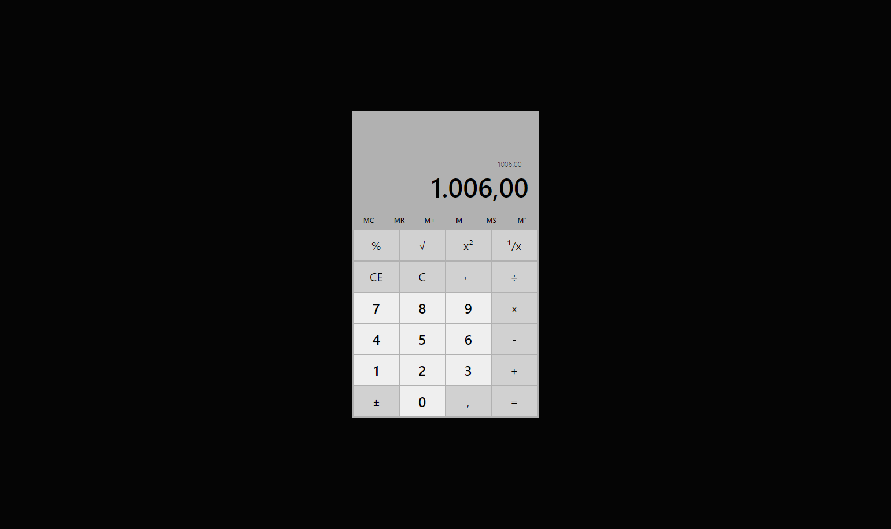

# Calculadora do Windows 10 em HTML (Clone)

Calculadora desenvolvida baseada no exemplo do Curso Completo de JavaScript na Udemy.com.
Essa calculadora é a versão HTML da Calculadora do Windows 10, dada como desafio pessoal adicional ao curso.

### Projeto

